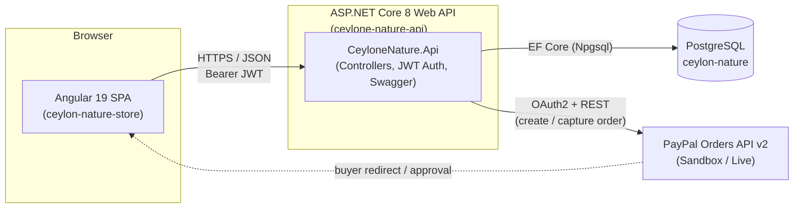
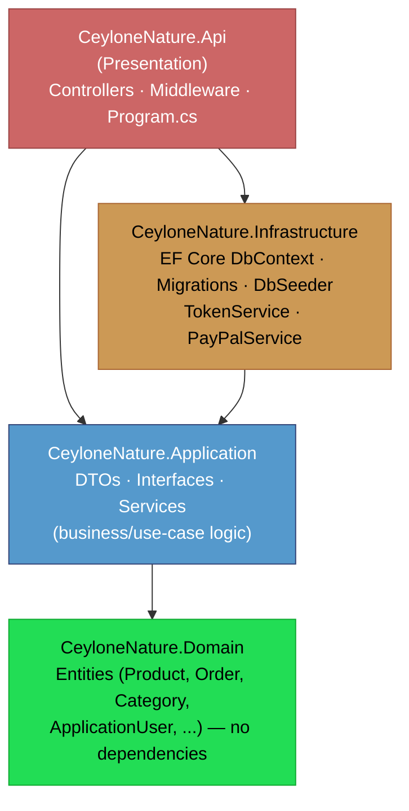
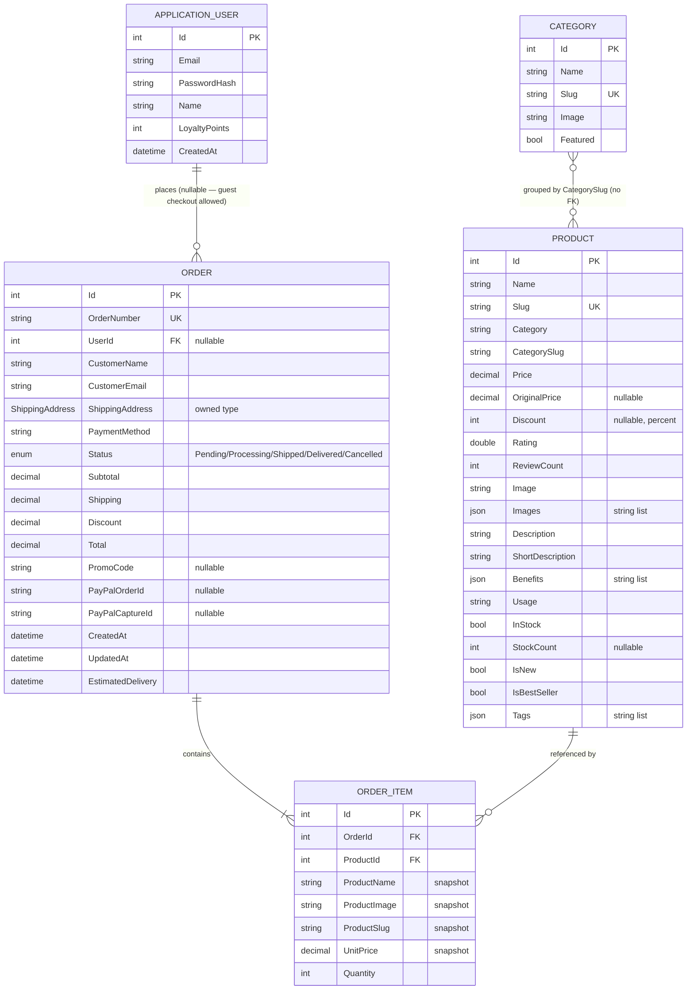
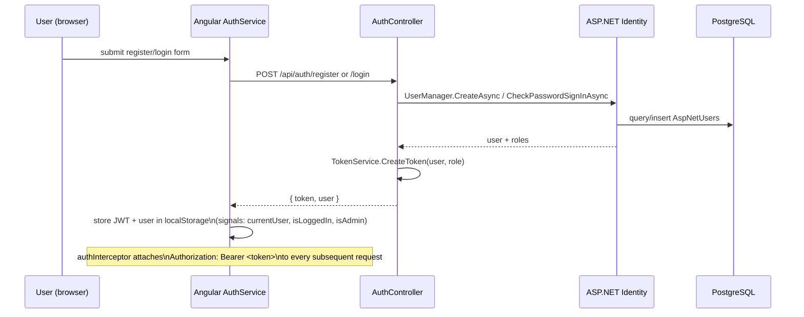
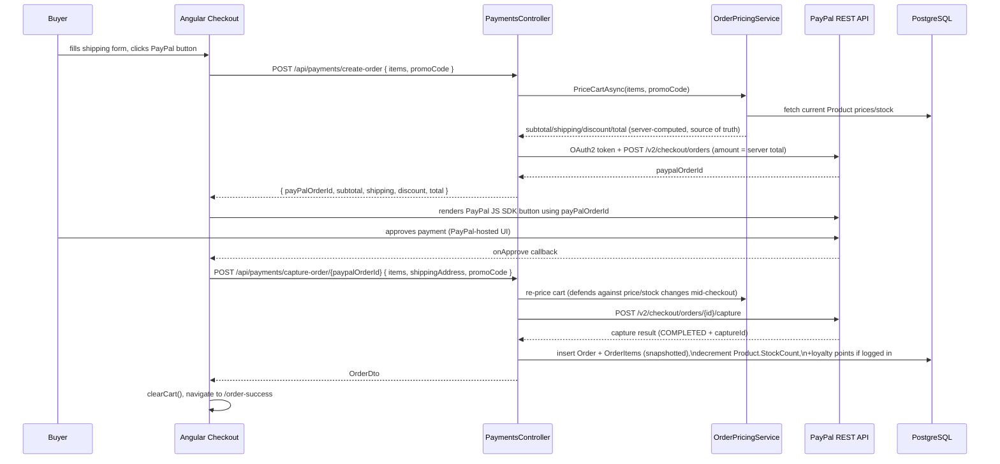
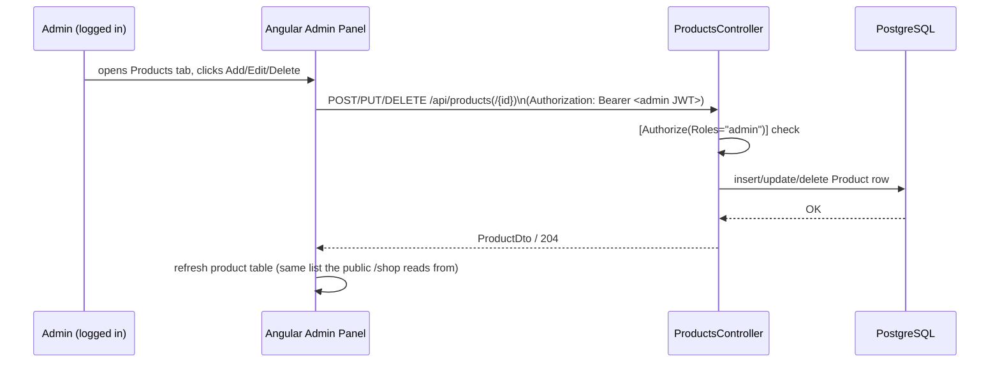
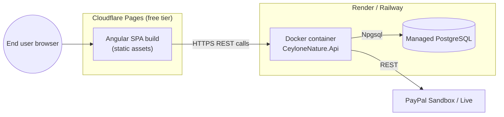

# Ceylon Nature Store — Backend Technical Documentation

This document describes the architecture of the Ceylon Nature Store backend (`ceylone-nature-api`) and how it integrates with the Angular storefront (`ceylon-nature-store`). It is intended as the technical reference for developers working on or deploying the system.

## Table of Contents

1. [System Overview](#1-system-overview)
2. [Clean Architecture Layers](#2-clean-architecture-layers)
3. [Solution / Folder Structure](#3-solution--folder-structure)
4. [Domain Model & Database Schema](#4-domain-model--database-schema)
5. [Authentication & Authorization](#5-authentication--authorization)
6. [API Reference](#6-api-reference)
7. [Checkout & PayPal Payment Flow](#7-checkout--paypal-payment-flow)
8. [Admin Product Management Flow](#8-admin-product-management-flow)
9. [Cross-Cutting Concerns](#9-cross-cutting-concerns)
10. [Deployment Architecture](#10-deployment-architecture)
11. [Tech Stack Summary](#11-tech-stack-summary)

---

## 1. System Overview



- The Angular app is a fully client-rendered SPA (standalone components, signals for state) that talks to the API exclusively over HTTP/JSON.
- The API is the single source of truth for products, categories, orders, users and payments. No business logic lives in the frontend beyond cart/wishlist convenience state (kept in `localStorage` for guest-friendliness).
- PayPal is integrated server-side: the API creates and captures PayPal orders directly against PayPal's REST API so card/account credentials never pass through our own backend, while order totals are still authoritatively priced and validated server-side (see [§7](#7-checkout--paypal-payment-flow)).

---

## 2. Clean Architecture Layers

The API follows the standard four-layer Clean Architecture (a.k.a. Onion Architecture) shape. Dependencies only point **inward** — outer layers reference inner layers, never the reverse.



| Layer | Responsibility | Depends on | Key contents |
|---|---|---|---|
| **Domain** | Pure business entities, no framework/infra concerns | *(nothing)* | `Product`, `Category`, `Order`, `OrderItem`, `ApplicationUser`, `ShippingAddress` (owned value object), `OrderStatus` enum |
| **Application** | Use-case logic, orchestration, contracts that Infrastructure must fulfil | Domain | DTOs, `IApplicationDbContext` (persistence abstraction), `I*Service` interfaces, `*Service` implementations (`ProductsService`, `OrdersService`, `PaymentsService`, `AdminService`, `AuthService`, `OrderPricingService`), `MappingExtensions` |
| **Infrastructure** | Concrete implementations of Application's contracts | Application, Domain | `AppDbContext` (implements `IApplicationDbContext`, extends `IdentityDbContext`), EF Core Migrations, `DbSeeder`, `TokenService` (JWT issuing), `PayPalService` (PayPal REST integration) |
| **Api** | HTTP surface, composition root | Application, Infrastructure | Controllers (thin — delegate to Application services), JWT bearer configuration, CORS, Swagger, `ExceptionHandlingMiddleware`, `Program.cs` |

This shape means: swapping PostgreSQL for another database only touches `Infrastructure`; swapping PayPal for another processor only touches `Infrastructure` (behind `IPayPalService`); and unit tests for business rules (pricing, stock validation) can run against `Application` without spinning up a database.

Each layer exposes its own `AddXServices(IServiceCollection)` extension method (`Application.DependencyInjection`, `Infrastructure.DependencyInjection`), which `Program.cs` composes — the standard Clean Architecture composition-root pattern.

---

## 3. Solution / Folder Structure

```
ceylone-nature-api/
├── CeyloneNature.sln
├── global.json                  # pins SDK to 8.0.x
├── Dockerfile                   # multi-stage build for Render/Railway
├── render.yaml / railway.json   # hosting platform configs
├── README.md                    # local setup + deployment steps
└── src/
    ├── CeyloneNature.Domain/
    │   └── Entities/
    │       ├── Product.cs  Category.cs  Order.cs  OrderItem.cs
    │       ├── ApplicationUser.cs  ShippingAddress.cs  OrderStatus.cs
    │
    ├── CeyloneNature.Application/
    │   ├── Common/            IApplicationDbContext.cs, Exceptions.cs
    │   ├── Dtos/               ProductDtos, OrderDtos, AuthDtos, AdminDtos, PaymentDtos
    │   ├── Interfaces/         IProductsService, IOrdersService, IPaymentsService,
    │   │                       IAdminService, IAuthService, ITokenService, IPayPalService, ICategoriesService
    │   ├── Services/           ProductsService, OrdersService, PaymentsService, AdminService,
    │   │                       AuthService, CategoriesService, OrderPricingService, MappingExtensions
    │   └── DependencyInjection.cs
    │
    ├── CeyloneNature.Infrastructure/
    │   ├── Data/AppDbContext.cs
    │   ├── Data/Seed/DbSeeder.cs
    │   ├── Migrations/         (EF Core migrations, Npgsql provider)
    │   ├── Services/           TokenService.cs, PayPalService.cs
    │   └── DependencyInjection.cs
    │
    └── CeyloneNature.Api/
        ├── Controllers/        AuthController, ProductsController, CategoriesController,
        │                       OrdersController, PaymentsController, AdminController
        ├── Middleware/          ExceptionHandlingMiddleware.cs
        ├── Program.cs           composition root
        └── appsettings.json
```

---

## 4. Domain Model & Database Schema



Notes:
- **ASP.NET Core Identity** provides the `AspNetUsers` / `AspNetRoles` / `AspNetUserRoles` tables (via `IdentityDbContext<ApplicationUser, IdentityRole<int>, int>`); `ApplicationUser` extends `IdentityUser<int>` with `Name`, `LoyaltyPoints`, `CreatedAt`.
- `Order.ShippingAddress` is an EF Core **owned type** (`OwnsOne`), stored as columns on the `Orders` table rather than a separate table.
- `Product.Images` / `Benefits` / `Tags` are `List<string>` mapped via a JSON `ValueConverter` to a single text/jsonb column — avoids extra join tables for simple string lists.
- `OrderItem` **snapshots** the product name/image/slug/price at purchase time, so historical orders remain accurate even if a product is later edited or deleted (`Product` FK uses `DeleteBehavior.Restrict` — a product can't be deleted once it has order history).
- `Category.ProductCount` is **not stored** — it's computed at query time as `COUNT(Products WHERE CategorySlug = Category.Slug)`, fixing the inconsistent hardcoded counts that existed in the original frontend mock data.
- Inventory alerts and revenue-by-week (admin dashboard) are also **computed on demand**, not stored: alerts from `Product.StockCount` thresholds (`< 5` critical, `< 15` low, `== 0` out-of-stock), revenue from `Orders` grouped by week over the trailing 8 weeks (excluding cancelled orders).

---

## 5. Authentication & Authorization

- **ASP.NET Core Identity** (`UserManager`, `SignInManager`, `RoleManager`) backed by PostgreSQL via `AppDbContext`, with two roles: `admin` and `customer`.
- **JWT Bearer tokens** (`Microsoft.AspNetCore.Authentication.JwtBearer`), issued by `TokenService`, containing `sub` (user id), `email`, `name` and a `role` claim. Tokens are valid for 7 days and signed with HMAC-SHA256 using `Jwt:Key`.
- A single **admin account is auto-seeded** on first run (`DbSeeder`) from `Seed:AdminEmail` / `Seed:AdminPassword` configuration — no self-service admin signup endpoint exists.
- Registration (`POST /api/auth/register`) always assigns the `customer` role.
- **Guest checkout is fully supported**: placing an order and capturing a PayPal payment do not require authentication — `PaymentsController.CaptureOrder` reads the caller's user id from the JWT *if present* (optional `[Authorize]`), otherwise the order is created with `UserId = null`. Logged-in customers additionally earn loyalty points (`1 point per $1 spent`, floored) on successful capture.



Authorization policy summary:

| Endpoint group | Policy |
|---|---|
| `GET` product/category browsing | Anonymous |
| `POST/PUT/DELETE /api/products` | `[Authorize(Roles = "admin")]` |
| `GET /api/orders/mine` | `[Authorize]` (any authenticated role) |
| `GET /api/orders`, `PUT /api/orders/{id}/status` | `[Authorize(Roles = "admin")]` |
| `GET /api/orders/{id}` | `[Authorize]` — service layer additionally checks the order belongs to the caller unless caller is admin |
| `POST /api/payments/*` | Anonymous (guest checkout) — user id attached opportunistically if a valid JWT is present |
| `GET /api/admin/*` | `[Authorize(Roles = "admin")]` (controller-level) |
| `GET/POST /api/auth/*` | Anonymous, except `GET /api/auth/me` which requires `[Authorize]` |

---

## 6. API Reference

Base URL: `{apiUrl}/api` (e.g. `https://localhost:44380/api` in dev, configured via Angular `environment.apiUrl`).

### Auth — `/api/auth`
| Method | Route | Auth | Body / Query | Response |
|---|---|---|---|---|
| POST | `/register` | — | `{ name, email, password }` | `AuthResponseDto { token, user }` |
| POST | `/login` | — | `{ email, password }` | `AuthResponseDto { token, user }` |
| GET | `/me` | JWT | — | `UserDto` |

### Products — `/api/products`
| Method | Route | Auth | Query/Body | Response |
|---|---|---|---|---|
| GET | `/` | — | `category, minPrice, maxPrice, popularity, search, sortBy, page, pageSize` | `PaginatedProductsDto` |
| GET | `/featured?count=4` | — | — | `ProductDto[]` |
| GET | `/{slug}` | — | — | `ProductDto` |
| GET | `/{id}/related?count=4` | — | — | `ProductDto[]` |
| POST | `/` | admin | `ProductUpsertRequest` | `ProductDto` (201) |
| PUT | `/{id}` | admin | `ProductUpsertRequest` | `ProductDto` |
| DELETE | `/{id}` | admin | — | 204 |

`popularity` ∈ `best-sellers | top-rated | new-arrivals`; `sortBy` ∈ `newest | price-asc | price-desc | rating` — mirrors the filtering/sorting semantics that used to live in Angular's `ProductService` (now server-side).

### Categories — `/api/categories`
| Method | Route | Auth | Response |
|---|---|---|---|
| GET | `/` | — | `CategoryDto[]` (with computed `productCount`) |

### Orders — `/api/orders`
| Method | Route | Auth | Body/Query | Response |
|---|---|---|---|---|
| GET | `/mine` | JWT | — | `OrderDto[]` for the current user |
| GET | `/` | admin | `?status=` | `OrderDto[]`, optionally filtered |
| GET | `/{id}` | JWT | — | `OrderDto` (owner or admin only) |
| PUT | `/{id}/status` | admin | `{ status }` | `OrderDto` |

### Payments — `/api/payments`
| Method | Route | Auth | Body | Response |
|---|---|---|---|---|
| POST | `/create-order` | optional | `CreatePayPalOrderRequest { items[], promoCode? }` | `CreatePayPalOrderResponse { payPalOrderId, subtotal, shipping, discount, total }` |
| POST | `/capture-order/{paypalOrderId}` | optional | `CapturePayPalOrderRequest { items[], shippingAddress, promoCode? }` | `OrderDto` |

### Admin — `/api/admin` (all routes `[Authorize(Roles = "admin")]`)
| Method | Route | Response |
|---|---|---|
| GET | `/stats` | `AdminStatsDto` |
| GET | `/revenue` | `RevenueDataPointDto[]` (last 8 weeks) |
| GET | `/inventory-alerts` | `InventoryAlertDto[]` |
| GET | `/customers` | `CustomerDto[]` (aggregated from Orders + Identity users) |

All error responses are shaped as RFC 7807 problem-details JSON by `ExceptionHandlingMiddleware`, translating `ValidationException` → 400, `NotFoundException` → 404, `PaymentGatewayException` → 502, unhandled exceptions → 500.

---

## 7. Checkout & PayPal Payment Flow

Cart contents stay client-side (`localStorage`, via Angular's `CartService`) until checkout — the server only sees the cart once the buyer is ready to pay, and **re-prices and re-validates everything server-side** so a tampered client-side total can never be charged.



Key server-side guarantees:
- The amount sent to PayPal, and the amount ultimately persisted as `Order.Total`, both come from `OrderPricingService` — never from client-supplied totals.
- Stock is checked (`insufficient stock` → 400) at pricing time and decremented at capture time.
- `PayPal:ClientId` / `PayPal:ClientSecret` (Sandbox by default, `PayPal:Mode` config) are the only values needed to point this at a real PayPal Sandbox or Live app.

---

## 8. Admin Product Management Flow



Because both the public storefront and the admin panel read from the same `Products` table via the same `ProductsController`/`ProductsService`, any admin edit is reflected on `/shop` immediately — there is no separate "draft" catalog.

---

## 9. Cross-Cutting Concerns

- **CORS**: configurable allow-list (`Cors:AllowedOrigins`, comma-separated) — defaults to `http://localhost:4200` for local Angular dev; set to the deployed Cloudflare Pages URL in production.
- **Error handling**: `ExceptionHandlingMiddleware` centralizes exception → HTTP status mapping so controllers stay thin and don't need try/catch blocks.
- **Startup migrations & seeding**: `Program.cs` runs `Database.MigrateAsync()` and `DbSeeder.SeedAsync()` on every boot — idempotent, so first deploy to Render/Railway needs no manual migration step.
- **Swagger/OpenAPI**: enabled in `Development` only, with a JWT bearer security scheme wired in for testing authorized endpoints directly from the Swagger UI.
- **Secrets**: local development uses `dotnet user-secrets` (never committed); hosting platforms use environment variables with `__` as the section separator (e.g. `ConnectionStrings__DefaultConnection`, `Jwt__Key`, `PayPal__ClientId`).

---

## 10. Deployment Architecture



- `Dockerfile` is a multi-stage build that restores/publishes the whole solution and runs `CeyloneNature.Api.dll`, listening on port `8080` (`ASPNETCORE_URLS`), which both Render and Railway auto-detect.
- `render.yaml` / `railway.json` document the required environment variables (`ConnectionStrings__DefaultConnection`, `Jwt__Key`, `PayPal__ClientId`, `PayPal__ClientSecret`, `Cors__AllowedOrigins`) — see the root [README.md](../README.md) for the full setup walkthrough.
- The Angular build is deployed as static files to Cloudflare Pages; `environment.prod.ts` points `apiUrl` at the deployed API's public URL.

---

## 11. Tech Stack Summary

| Concern | Choice |
|---|---|
| Frontend framework | Angular 19 (standalone components, signals), Bootstrap 5 |
| Backend framework | ASP.NET Core 8 Web API, C# |
| Architecture | Clean Architecture (Domain / Application / Infrastructure / Api) |
| ORM | Entity Framework Core 8 + Npgsql provider |
| Database | PostgreSQL |
| Auth | ASP.NET Core Identity + JWT Bearer |
| Payments | PayPal Orders API v2 (Sandbox/Live) |
| API docs | Swagger / OpenAPI (dev only) |
| Frontend hosting | Cloudflare Pages |
| Backend hosting | Render or Railway (Docker) |
| Database hosting | Managed PostgreSQL on Render/Railway |

See also: [`ceylon-nature-store/docs/FRONTEND_ARCHITECTURE.md`](../../ceylon-nature-store/docs/FRONTEND_ARCHITECTURE.md) for the Angular-side integration details, and the root [README.md](../README.md) for local setup and deployment steps.
